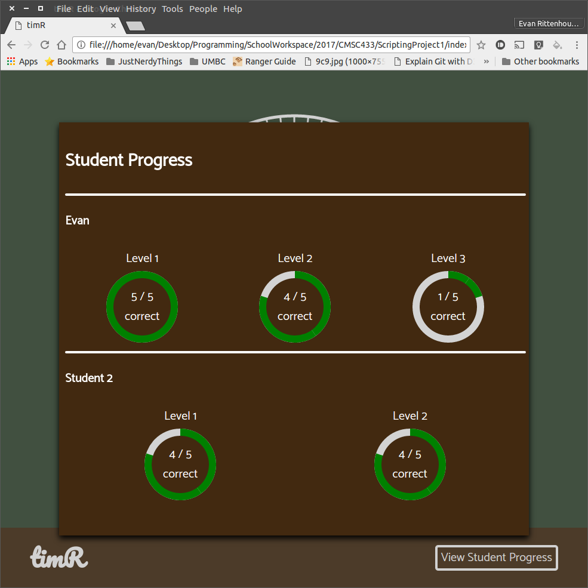

# timR - Read Analog Clocks

_[Youtube Video](https://youtu.be/-2rDyiZGWP8)_

_Evan Rittenhouse - eritte2 at umbc dot edu - Lead programmer/designer_

_This page best viewed on [GitHub](github.com/emanguy/ScriptingProject1)_

**You can access timR by opening index.html.**

timR is a modular single page webapp that allows children to practice reading analog clocks. It defines many custom HTML elements and reuses them all over the place. This modularity makes the site easily modifiable, updatable, and readable. All of the code in this project is written by Evan Rittenhouse and the only external stuff that was added are the font files in `shared-styles/fonts/`.

## Bundling timR

Even though timR uses the latest HTML standards and could be served as-is from an HTML server, Chrome's CORS policy does not allow the importing of custom elements when a page is served from the filesystem. Therefore, I use [polymer-bundler](https://github.com/Polymer/polymer-bundler) to bundle all of the imported HTML files from `index-unbundled.html` into a single inline HTML page which is much longer and not as maintainable. **I highly recommend making changes to `index-unbundled.html` and its imported pages then bundling rather than directly modifying `index.html`.**

### Installing the polymer-bundler tool

 1. Install [Node.js](https://nodejs.org/en/download/) on your development machine so you can use the Node Package Manager.
 2. Open a terminal (or command prompt).
 3. Run the command `npm install -g polymer-bundler` to install the polymer-bundler tool.

### Bundle your updated code into index.html

 1. Open a terminal (or command prompt) and navigate to the root directory of this project.
 2. Run the command `polymer-bundler index-unbundled.html > index.html`.

## Webapp Design

timR is a game split into 5 different levels:
 1. Determine the hour on the displayed clock
 2. Determine the minute on the displayed clock
 3. Determine both the hour and the minute on the displayed clock
 4. Given a time, select the clock that displays it
 5. Select the clock displaying the latest time (so if you were presented with 3:00, 5:00, and 2:00 you would choose 5:00).

These 5 levels are supposed to help children practice all aspects of reading analog. Each one increases slightly in difficulty, building upon skills practiced in previous levels to challenge the kids. The webapp is designed such that a child can stop at whatever level they want and return to the main menu, so if a teacher only wants them to work on levels 1-3 for instance they can tell them to return to the main menu after level 3. Level statistics are only recorded when the level is completed and results are displayed accordingly in the student progress overlay.

Students cannot lose because this is just practice. After every question they are given feedback (either a "correct" overlay or an "incorrect" overlay displaying the correct answer) and at the end of each level they are told how many questions they got correct. At any time the teacher can click the "view student progress" button to see how the students are doing. Student progress is displayed very visually with progress wheels, allowing the teacher to easily glance at and tell which students are having the most trouble with given levels.

## Code Design

The code is neatly modularized in custom elements which are defined in the many folders you'll see in the project. All of the code is commented so hopefully it won't be hard to read, but I can get you started. Here's what you'll need to know:

### How to change teacher password

Edit `index-unbundled.html` and find the "teacher-stats-overlay" element. Change its "teacher-password" attribute to the desired password. Be sure to bundle the page afterward.

### How to change the length of levels

Edit `index-unbundled.html` and find the level-fixture for the level you want to change the number of questions for. Change the `num-questions` attribute to the number of questions you want asked during that level.

### Code walkthrough

_Note: Due to the nature of HTML imports and Shadow DOM within custom elements, custom elements have inline scripts and stylesheets to circumvent the Shadow DOM's style encapsulation properties and the nature of HTML imports as separate HTML documents. HTML Imports are not considered part of the main document, but rather already-parsed documents._

 * index-unbundled.html - The main (unbundled) page which displays all content. You can add more levels here if you so desire.
 * level-fixture/
   * level-complete-overlay.html - Extends `OverlayElement` and displays the number of questions you got correct at the end of a level.
   * question-result-overlay.html - Extends `OverlayElement` and displays whether you got an individual question correct or incorrect.
   * level.html - The parent class for levels, `LevelElement`. Provides a helper function for levels for notifying the surrounding `level-fixture` that the user completed a question.
   * level-fixture.html - Extends `Page` and provides common UI for all levels. Handles switching to next level, displaying instructions before a level, and causing the level to randomly generate a new question.
 * levels/ - The elements inside all extend `LevelElement` and provide the HTML code for displaying the questions in levels 1-5.
 * levels-complete-page/levels-complete-page.html - This element extends `Page` and shows a congratulatory message upon completing all the levels.
 * main-page/main-page.html - This element extends `Page` and shows the spinning clock and "start game" button.
 * name-entry-page/name-entry-page.html - This element extends `Page` and requests the user enter their name before completing levels. Fires an event to notify any listeners that a name has been entered.
 * overlay-container/
   * demo.html - A testing area where I tested the capabilities of the `overlay-container` element.
   * overlay-container.html - Defines the `overlay-container` element that provides the dark gray overlay containment area which allows overlays to float over the DOM content.
   * overlay.html - The parent class for overlays, `OverlayElement`. Properly animates the overlay on reveal and provides helper functions for the overlay dismissing itself.
 * page-switcher/
   * demo.html - My testing area for ensuring the `page-switcher` element was stable.
   * page-switcher.html - An element which reveals contained elements which extend `Page`. This allows me to "switch pages" in my UI without navigating to another HTML document.
   * page.html - The parent class for pages, `Page`. Provides a helper function which allows pages to notify the parent `page-switcher` that they should navigate to another page.
 * progress-wheel/
   * demo.html - My testing area for the progress wheel.
   * progress-wheel.html - Defines the `progress-wheel` element and value/maxValue properties which can be used to change how filled the wheel is. I made this using inspiration from [this progress wheel implementation](https://medium.com/@andsens/radial-progress-indicator-using-css-a917b80c43f9).
 * shadowDOMElement/shadowDOMElement.html - This is a helper class which helped me cut down on boilerplate for a lot of other elements I defined.
 * shared-styles/
   * fonts/ - Contains the .ttf files for the "Pacifico" and "Catamaran" fonts I use throughout the site.
   * shared-styles.css - CSS styles for common HTML elements such as the `button` tag or the `select` tag.
 * svg-clock/
   * demo.html - The test page I used to make svg-clock stable.
   * svg-clock.html - Defines the `svg-clock` element which renders a resizable clock. The clock exposes properties which I can use to set the hour and minute of the clock so the hands spin into place. I can also set an attribute on it to cause the hands to spin continuously.
 * teacher-stats-overlay/
   * teacher-stats-overlay.html - Defines the `teacher-stats-overlay` tag which is shown when the "view student progress" button is clicked.
   * results-page.html - Defines the `results-page` element which extends `Page`. Used by `teacher-stats-overlay` to dynamically generate the HTML for each student's progress based on a JSON object.
 * index-script.js - The main JS file which sets up event listeners on custom elements such as the `level-fixture`s. Also helps aggregate data when levels are completed and propagating said data to the `teacher-stats-overlay`.
 * index-style.css - The CSS file which is imported by `index-unbundled.html`. Imports `shared-styles.css` and more specifically styles elements on the main HTML page.
 * index.html - The HTML file that `polymer-bundler` generates from `index-unbundled.html`.